# Plainsboro Public Library — WiFi Site Survey


A passive 802.11 site survey of a three-storey, 46,500 sq ft public library, conducted
with permission on 27 August 2026. Two floors surveyed, 67 measurement points,
1,523 individual network observations, 8 access points characterised.

**The headline: coverage was never the problem.** Every measured location met the
−67 dBm design threshold on 5 GHz. What the data actually shows is a well-covered
network whose access points are competing with each other for airtime.

📄 **[Read the findings report](reports/Survey-Findings-Report.pdf)** ·
📊 **[Data pack (xlsx)](reports/Survey-Data-Pack.xlsx)** ·
🌐 **[Project site](https://packetgeist.tarunc.com)** — self-hosted; if it's down, everything is browsable here

---

## Ground floor — signal coverage

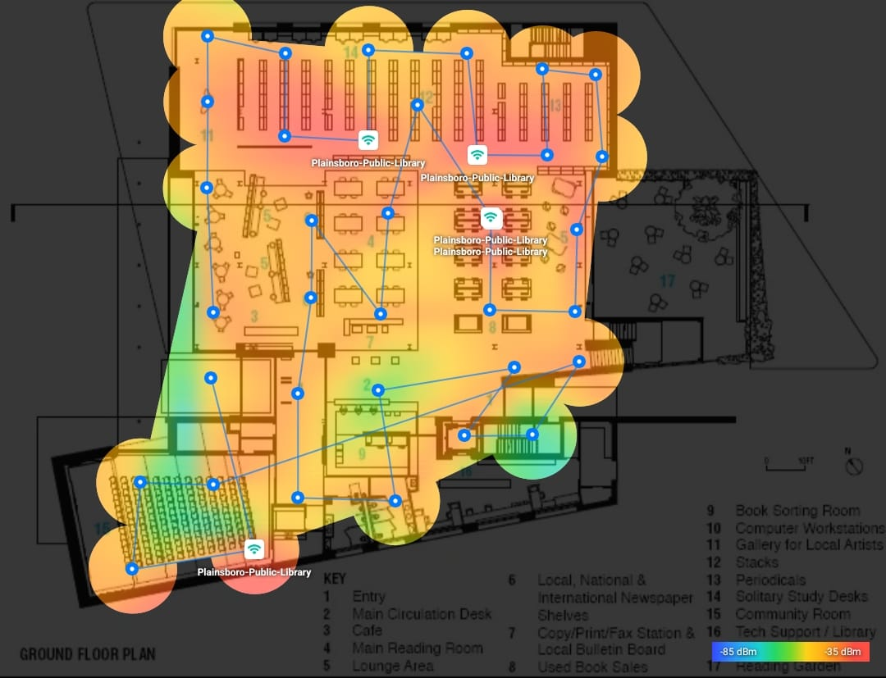

## Second floor — signal coverage

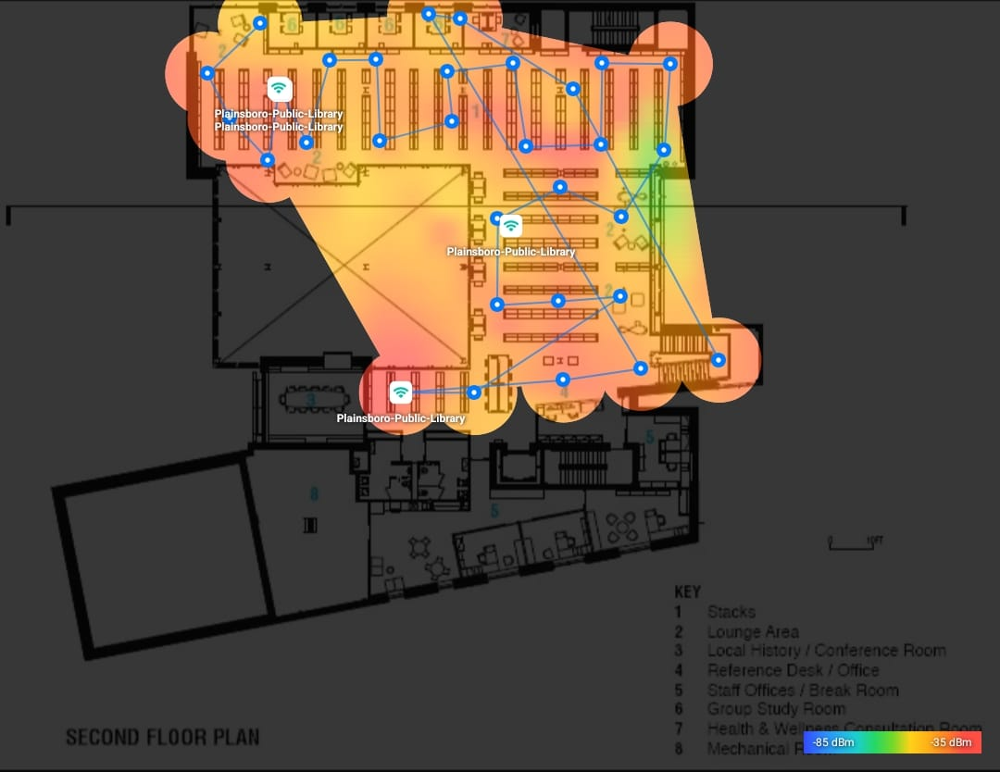

<details>
<summary><b>All six heatmaps — signal, SIR, and SNR, both floors</b></summary>
<br>

| Ground floor | Second floor |
|---|---|
| 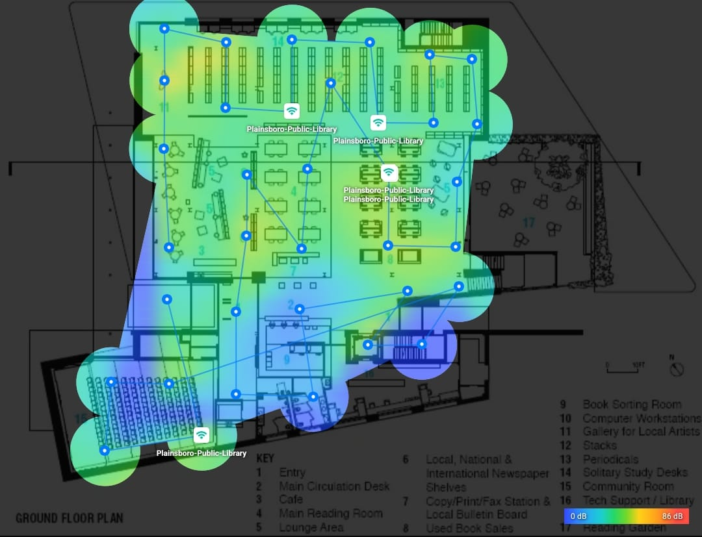 | 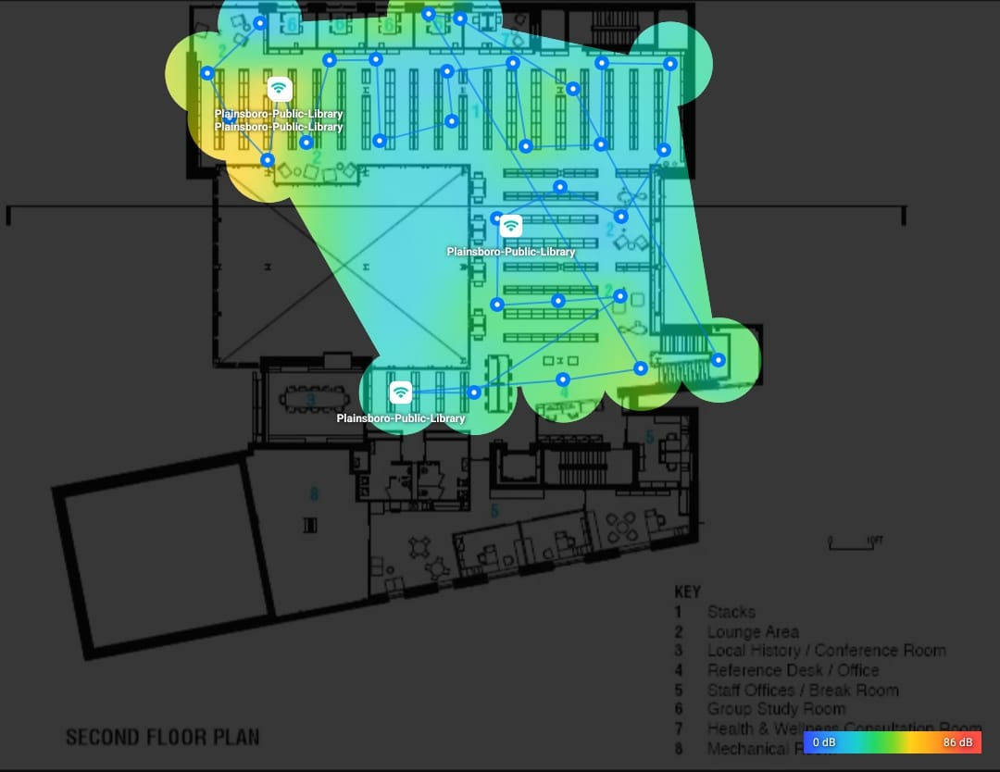 |
| Signal-to-interference ratio | Signal-to-interference ratio |
| 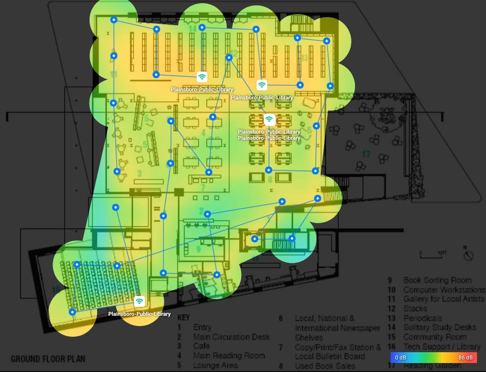 | 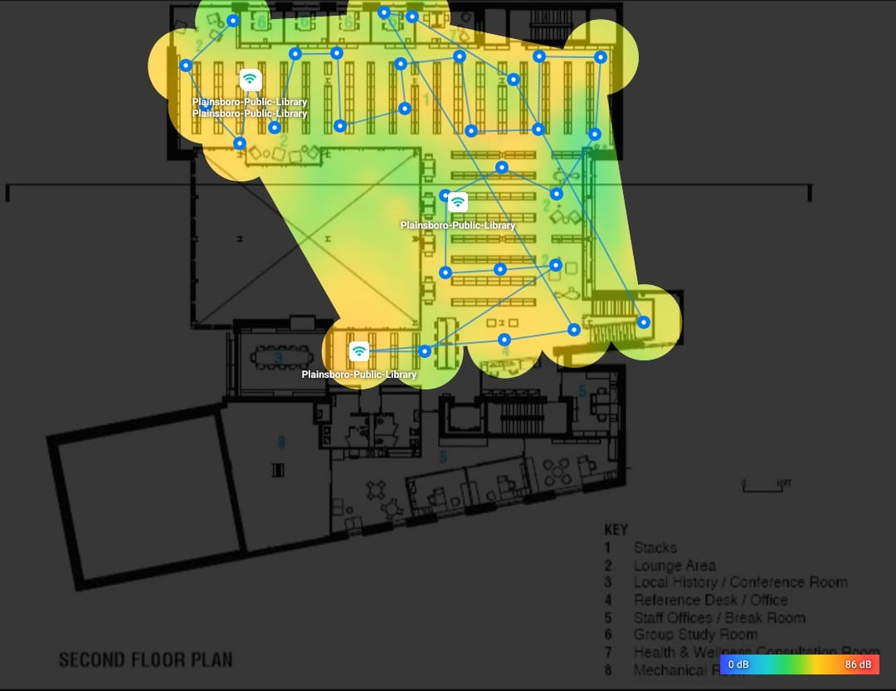 |
| Signal-to-noise ratio* | Signal-to-noise ratio* |

\* *The survey device did not expose per-point noise-floor data; SNR reflects NetSpot's internal calculation and is indicative only. See [assets/heatmaps/README.md](assets/heatmaps/README.md).*

</details>

## Source floor plans

<table>
<tr>
<td width="50%">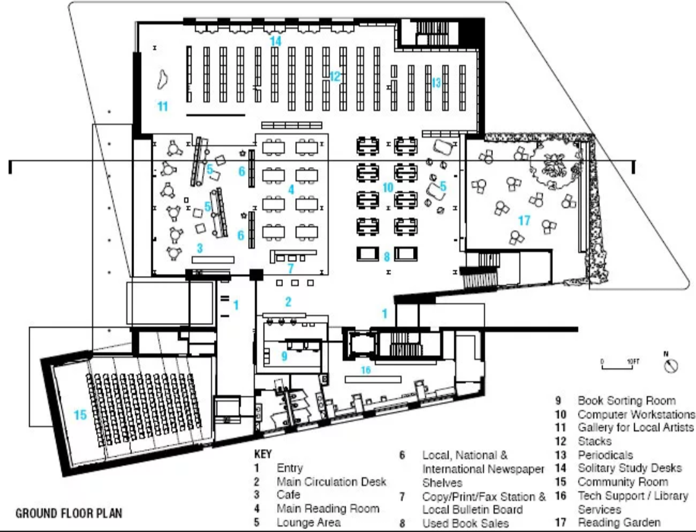</td>
<td width="50%">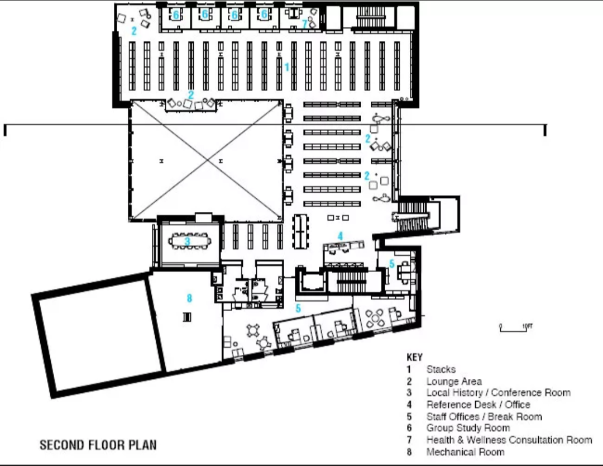</td>
</tr>
<tr><td align="center">Ground floor</td><td align="center">Second floor</td></tr>
</table>

*Architectural Record, "Plainsboro Public Library," 16 March 2011. Design drawings, not as-builts — see [Attribution](ATTRIBUTION.md).*

## What was found

| | |
|---|---|
| Points meeting −67 dBm on 5 GHz | **100%** (both floors) |
| Mean best 5 GHz signal | −49.7 dBm (Ground) / −51.3 dBm (Second) |
| Access points identified | 8 |
| APs sharing 2.4 GHz channel 6 | **5 of 8** |
| APs sharing 5 GHz channel 149 | **3 of 8**, at mismatched widths |
| Library radios audible at one point | 7.3 average, **13 peak** |
| APs audible on *both* floors ≥ −67 dBm | **6 of 8** |

Six findings, F-01 to F-06. The primary recommendations are configuration changes
at zero hardware cost — and explicitly *not* adding access points.

## Where this lives

The site is served from a DMZ container in my own lab at
**[packetgeist.tarunc.com](https://packetgeist.tarunc.com)**. That is home hardware, so
if it is unreachable, this repository holds the same content — the report, the data, the
analysis and the site itself — and GitHub Pages serves a rendered copy of this
repository as a fallback.

## Repository layout

```
assets/        Floor plans, heatmap exports, client-side evidence
data/          Everything extracted from the survey database, as CSV
deploy/        nginx vhost for the DMZ container
docs/          Written analysis, methodology, and the guides
field/         The field methodology documents used to run the survey
planning/      Predictive model — proposed remediation
reports/       Findings report (PDF) and data pack (xlsx)
index.html     The site
```

## Data

Extracted directly from the NetSpot project database (`.netspu` is a zip
containing a SQLite database). All CSVs are machine-readable and reproducible
from the raw export.

| File | Rows | Contents |
|---|---|---|
| `data/raw-readings.csv` | 1,523 | Every individual observation: SSID, BSSID, RSSI, channel, width, band, security string |
| `data/scan-points.csv` | 67 | Per-location best signal by band, plus co-channel exposure counts |
| `data/ap-inventory.csv` | 8 | Access points with both radios, channels, widths, peak signal |
| `data/channel-usage.csv` | 14 | BSSID count per channel at ≥ −80 dBm |
| `data/cross-floor-propagation.csv` | 8 | Per-AP reach on each floor — the evidence for F-05 |
| `data/external-networks.csv` | 23 | Non-library networks detected |
| `data/plainsboro-survey.netspu` | — | Raw NetSpot project export |

## Method

Passive survey only. Broadcast beacon measurement, no association testing, no
traffic capture, no interaction with library infrastructure. Permission was
requested on arrival and again for the Community Room after its scheduled event
ended; a study room was reserved through the library's normal booking system.

The third floor (children's level) was deliberately excluded. The mechanical room
was not entered.

## Limitations

Stated plainly, because a survey report claiming none is telling you the author
doesn't know what they are:

- **No 6 GHz visibility.** Survey device is dual-band Wi-Fi 5. If 6E/7 equipment
  exists on site, it is absent from this data entirely.
- **Single-stream client.** 1×1 radio; observed link rates describe the client,
  not the network.
- **Uncalibrated radio.** Consumer chipset, roughly ±3–6 dB of absolute
  uncertainty. Findings rest on relative comparison under a consistent method.
- **No spectrum analyser.** Non-WiFi interference is inferred, not observed. The
  device reported no noise-floor data, so no SNR-based finding is made.
- **AP positions are estimated.** Trilaterated by software, not physically
  verified. Channel assignments and AP counts, however, are read from beacon data
  and are reliable.
- **Materials are documentary.** Construction materials come from the building's
  published product schedule, not on-site assessment.
- **Single time sample.** One evening, roughly 50 people in the building.

## Client-side evidence

<table>
<tr>
<td width="33%">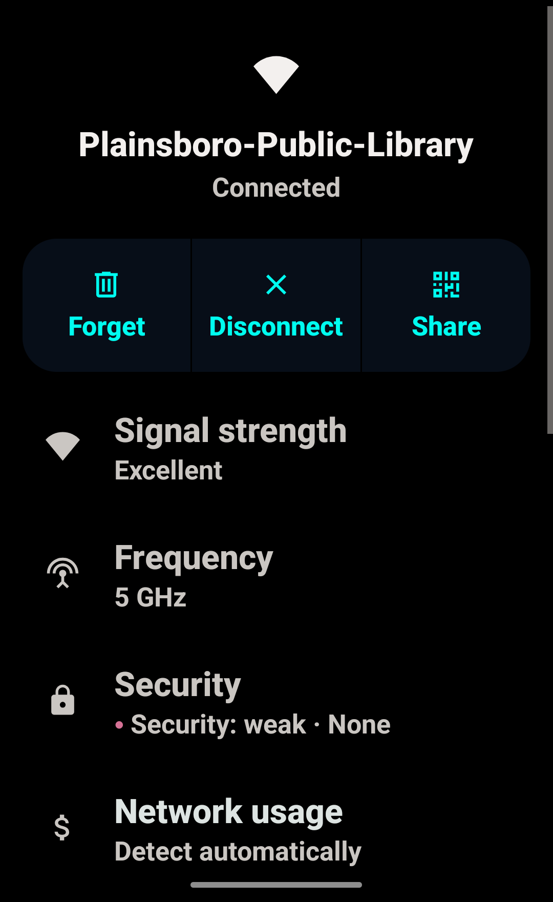</td>
<td width="33%">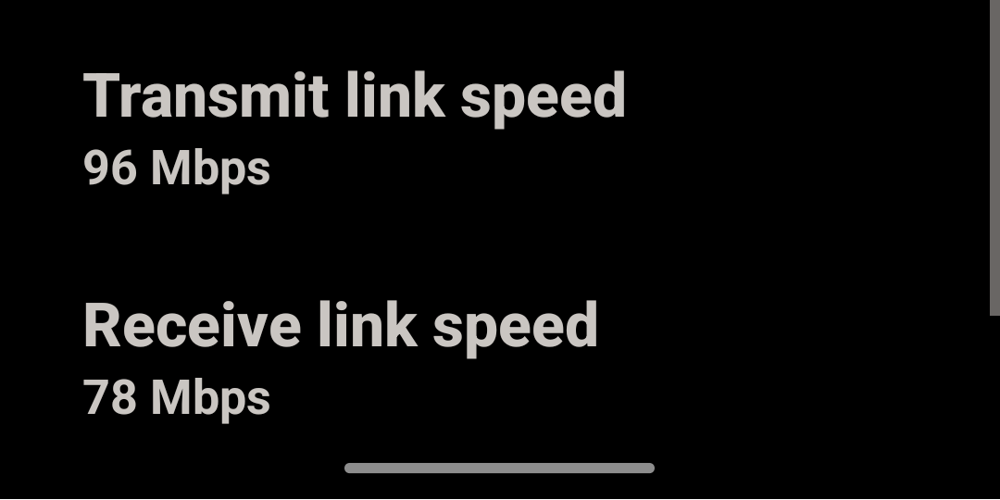</td>
<td width="33%">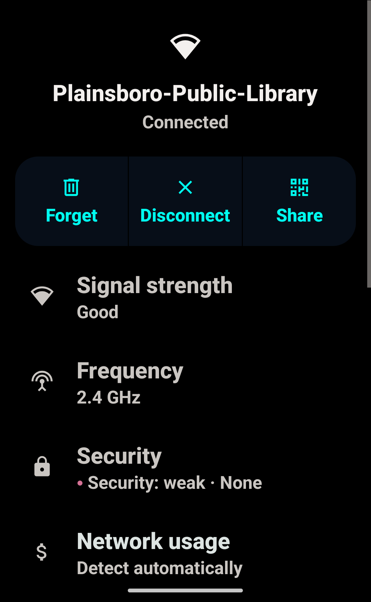</td>
</tr>
<tr>
<td align="center" width="33%">Security: weak · None</td>
<td align="center" width="33%">96 / 78 Mbps at ≈−50 dBm</td>
<td align="center" width="33%">Confirmed again on 2.4 GHz</td>
</tr>
</table>

Independent measurements from the phone's own network stack, not NetSpot — corroborating F-04 and F-03. See [assets/screenshots/README.md](assets/screenshots/README.md).

## Attribution

Floor plans and construction product schedule: *Architectural Record*, "Plainsboro
Public Library", 16 March 2011. Building by BKSK Architects, completed May 2010.
Reproduced here under fair use for non-commercial technical analysis.

Architectural photography by Jeffrey Totaro and Vanni Archive is **not** reproduced
in this repository.

## License

Analysis, code, and documentation: MIT. Survey data: CC BY 4.0.
Third-party material as noted above retains its original rights.

## Guides

- [Completion guide](docs/Completion-Guide.pdf) — remaining steps, git and DNS commands, outreach
- [Study guide](docs/Study-Guide.pdf) — every concept in this project, plus a self-test
- [Build & deploy runbook](docs/Build-Deploy-Runbook.pdf) — GitHub, DMZ hosting, tunnel, DNS

## Hosting

Served as a second vhost on the existing DMZ container from the Cherwood Corporation
lab network (VLAN 40), published through the existing Cloudflare named tunnel. No new
container, tunnel or firewall rule was required.
See [`deploy/`](deploy/) for the nginx vhost and the three steps to add it.

Packetgeist is Division 02 of the [Cherwood Corporation](https://cherwood.tarunc.com) lab.
